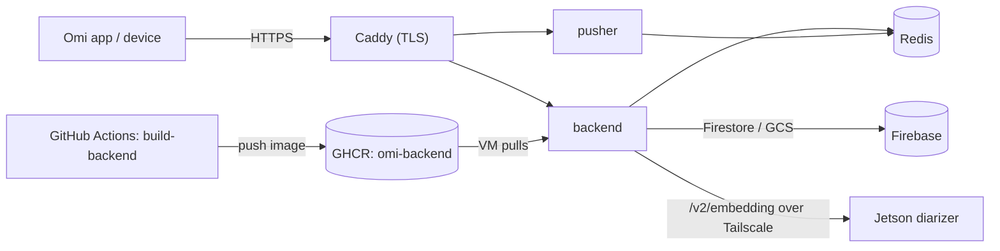

# Self-hosted Omi (`selfhost` branch)

A self-hosting fork of [`BasedHardware/omi`](https://github.com/BasedHardware/omi): the Omi backend
running on infrastructure you control (a GCP VM + Firebase + your own STT/LLM keys) instead of Omi's
hosted cloud. It tracks upstream through an `upstream` remote and carries a small set of self-host
changes as commits on top of a pinned upstream baseline.

> **Secrets and exact infra IDs are intentionally not in this public repo.** The Docker Compose
> files, Caddy config, `.env`, and the full runbook (GCP project, VM, service account, IPs, secrets)
> live in a **private** `deploy/` bundle. This README documents the *process*; the private
> `RUNBOOK.md` holds the specifics.

## What's on this branch (vs. upstream)
- **`backend/`** — the upstream backend plus three self-host patches:
  - GCS V4 signed URLs via IAM **SignBlob**, so audio playback works on a **keyless** GCE VM (attached service account, no exported JSON key).
  - A **stale-conversation finalizer** (`backend/scripts/finalize_stale_conversations.py`), run from cron to close conversations stuck in `in_progress`.
  - An **app-update feed** (`backend/routers/app_update.py`): auth-gated `GET /v2/app/android/latest` + `/v2/app/android/download` that serve the self-host APK + metadata to the in-app updater (no embedded secrets).
- **`selfhost/jetson-diarizer/`** — an aarch64 speaker-embedding service for a Jetson that replaces Omi's hosted `diarizer`. See [`jetson-diarizer/README.md`](jetson-diarizer/README.md).
- **`.github/workflows/`** — CI that builds the backend image and watches upstream (below).

## Architecture
One backend image runs two services (`backend` and `pusher`); Redis and Caddy (TLS) complete the VM
stack. Speaker embeddings are offloaded to a Jetson over a private Tailscale mesh. Persistent data
lives in Firestore/GCS (Firebase). CI publishes the image to GHCR and the VM pulls it.



## CI/CD
Both workflows live in `.github/workflows/` on this branch.

### `build-backend.yml` — backend image → GHCR
- **Trigger:** push to `selfhost` touching `backend/**` (or the workflow itself), or manual `workflow_dispatch`.
- **Builds** `backend/Dockerfile` (build context = repo root, `--build-arg PYTHON_BASE_IMAGE=python:3.11-slim`, `linux/amd64`) and **pushes** `ghcr.io/cybervoid/omi-backend:latest` + `:sha-<commit>` using the built-in `GITHUB_TOKEN`.
- The package is **public**, so the VM pulls anonymously (no registry login). If a rebuilt package ever defaults back to private, flip it public again or `docker login ghcr.io` on the VM with a `read:packages` token.

### `upstream-sync.yml` — upstream drift notifier
- **Trigger:** weekly (Mondays 09:00 UTC) + manual.
- Compares this branch's base against `upstream/main`; if upstream is ahead, it opens (or reuses) a tracking **issue**. It deliberately does **not** auto-rebase — upgrades are manual so patch conflicts get human review.

### `build-app.yml` — signed dev APK artifact
- **Trigger:** push to `selfhost` touching `app/**` (or the workflow), or manual `workflow_dispatch`.
- Builds a release-signed `Omi Dev` APK (`com.friend.ios.dev`) using Actions secrets for the release keystore and dev Firebase config. The artifact contains `app-dev-release.apk` plus `latest.json` metadata. `versionName`/`versionCode` are derived from `app/pubspec.yaml` (build number + run number), so `latest.json` increments each run and the in-app updater can detect new builds.
- The APK is signed with the self-host release key whose SHA-1 is registered on the Firebase dev Android app. Because the fork is public, treat the GitHub artifact as an intermediate build output, not the preferred distribution channel.

### APK delivery — backend feed (app) + basic-auth browser fallback
- **In-app (preferred):** the backend serves an auth-gated feed — `GET /v2/app/android/latest` (metadata) and `/v2/app/android/download` (APK), both requiring the app's Firebase ID token. **Settings → About → Check for updates** uses this feed, so no credential is embedded in the app. Endpoints are backed by the VM `app-updates/` dir mounted read-only into the backend (`APP_UPDATES_DIR`).
- **Browser fallback:** Caddy also serves `/app/*` from `~/omi-deploy/app-updates/` behind Basic Auth (`https://35.223.15.33.sslip.io/app/latest.json` and `/app/omi-dev-release.apk`). Credentials live only in the private deploy bundle (`app-updates-basic-auth.txt`), not in this repo.
- To publish a future app build artifact, run the private helper from the deploy bundle:
```bash
cd ~/Documents/omi/deploy
./publish-app-update.sh <github-run-id>
```
- This helper downloads the `build-app` artifact and copies it to the VM over IAP; GitHub Actions does not receive VM SSH keys or inbound VM access.

## Deploy (pull-based)
The VM **pulls** the prebuilt image, so GitHub Actions never connects inbound to the VM and SSH can
stay locked down (e.g. IAP-only). On the VM, `backend`/`pusher` reference the GHCR image instead of
building locally:

```bash
# on the VM, in the deploy dir (from the private bundle)
./pull-deploy.sh        # docker compose -f docker-compose.ghcr.yml pull && up -d  (+ image prune)
```

- Pin a specific build with `OMI_IMAGE=ghcr.io/cybervoid/omi-backend:sha-<commit>` in `.env`; omit for `:latest`.
- **Hands-off CD:** a cron entry (`/etc/cron.d/omi-deploy`) runs `pull-deploy.sh` every 10 minutes and only recreates containers when the image digest actually changed.

## Smoke test
Run these after any deploy or upgrade; all should pass before calling a deploy good. Replace
`<VM_HOST>` with your public endpoint, and run the VM checks from the deploy dir (private bundle).
### Public API surface (from anywhere)
```bash
for p in /docs /openapi.json /v1/conversations /v1/conversations/count; do
  printf '%s  %s\n' "$(curl -sk -o /dev/null -w '%{http_code}' "https://<VM_HOST>$p")" "$p"
done
```
Expect `200` for `/docs` and `/openapi.json` (~350 routes), and `401` for the two `/v1/conversations*`
paths (auth enforced). In zsh, **don't** name the loop variable `path` — it's bound to `$PATH` and
will clobber it; use `p`.
### Backend dependencies (on the VM)
```bash
cd ~/omi-deploy
DC="docker compose -f docker-compose.ghcr.yml"
$DC exec -T redis redis-cli ping                               # -> PONG
DIARIZER_URL=$($DC exec -T backend printenv HOSTED_SPEAKER_EMBEDDING_API_URL | tr -d '\r')
curl -s "$DIARIZER_URL/health"                                 # -> {"status":"healthy"}
$DC logs pusher 2>&1 | grep "Application startup complete"     # pusher booted
$DC exec -T backend python -m scripts.finalize_stale_conversations --dry-run   # Firestore + patch 0002
$DC logs --since 10m backend 2>&1 | grep -iE "error|traceback" || echo "no errors"
```
Expect: Redis `PONG`; the diarizer `/health` healthy (Jetson reachable over Tailscale); the pusher
startup line present; the finalizer printing `Sweep start … / Sweep done …` (proves Firestore
connectivity and exercises patch 0002); and no errors in recent backend logs.
### Latest run — 2026-06-29
All checks **passed** on `ghcr.io/cybervoid/omi-backend:latest` (CI-built, auto-deployed):
- Public: `/docs` 200, `/openapi.json` 200 (350 routes), `/v1/conversations` 401, `/v1/conversations/count` 401.
- Redis `PONG`; pusher `Application startup complete`; backend logs clean (no errors/tracebacks in 10m).
- Firestore reachable — finalizer dry-run: `Sweep start: users=1 …` → `Sweep done: scanned=0 finalized=0`.
- Diarizer `/health` → `{"status":"healthy"}` over Tailscale.
- Patches: **0002** finalizer verified via dry-run; **0001** SignBlob loads clean (audio playback validated separately).

## Maintenance
### Upgrade from upstream
Rebase the self-host commits onto a newer upstream tag/commit, then push — CI rebuilds the image and
the VM picks it up on its next pull.
```bash
git fetch upstream
git rebase upstream/main          # or a release tag; resolve any conflicts in the patch commits
git push --force-with-lease origin selfhost
```
After it deploys, re-verify with the **Smoke test** section above (it covers the SignBlob audio path,
the finalizer `--dry-run`, and the diarizer round-trip). Watch for new required env keys and new
Firestore composite indexes.

### Jetson diarizer
Independent of upstream (it only mirrors the `/v2/embedding` contract). See
[`jetson-diarizer/README.md`](jetson-diarizer/README.md); only revisit it if upstream changes that
contract.

### Roll back
Redeploy a known-good build by setting `OMI_IMAGE=…:sha-<commit>` and re-running `pull-deploy.sh`,
or fall back to a local build with the bundle's `docker-compose.yml`.

## App updates
The app update pipeline now closes the loop end-to-end:
- **CI:** pushing app changes to `selfhost` auto-builds a signed dev APK with a dynamically derived `versionCode` (`build-app.yml`).
- **Delivery:** the APK + `latest.json` are published to the VM (admin-run `publish-app-update.sh` over IAP) and served through the auth-gated backend feed; the Basic Auth `/app/*` path is kept as a browser fallback.
- **In-app:** Settings → About → **Check for updates** compares the running `versionCode` to the feed, downloads + SHA-256-verifies the APK, and launches Android's installer via `open_filex` (user still approves the sideload).
- **Deferred:** a passive launch-time nudge and a VM-pull cron for hands-off delivery; publishing stays admin-run to preserve the IAP SSH lockdown.
