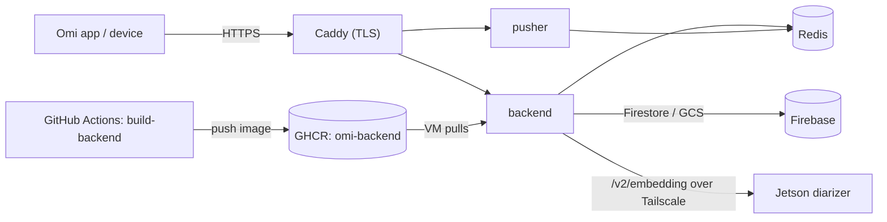

# Self-hosted Omi (`selfhost` branch)

A self-hosting fork of [`BasedHardware/omi`](https://github.com/BasedHardware/omi): the Omi backend
running on infrastructure you control (a GCP VM + Firebase + your own STT/LLM keys) instead of Omi's
hosted cloud. It tracks upstream through an `upstream` remote and carries a small set of self-host
changes as commits on top of a pinned upstream baseline.

> **Secrets and exact infra IDs are intentionally not in this public repo.** The Docker Compose
> files, Caddy config, `.env`, and the full runbook (GCP project, VM, service account, IPs, secrets)
> live in a **private** `deploy/` bundle. This README documents the *process*; the private
> `RUNBOOK.md` holds the specifics.

## What's on this branch (vs. upstream)
- **`backend/`** — the upstream backend plus two self-host patches:
  - GCS V4 signed URLs via IAM **SignBlob**, so audio playback works on a **keyless** GCE VM (attached service account, no exported JSON key).
  - A **stale-conversation finalizer** (`backend/scripts/finalize_stale_conversations.py`), run from cron to close conversations stuck in `in_progress`.
- **`selfhost/jetson-diarizer/`** — an aarch64 speaker-embedding service for a Jetson that replaces Omi's hosted `diarizer`. See [`jetson-diarizer/README.md`](jetson-diarizer/README.md).
- **`.github/workflows/`** — CI that builds the backend image and watches upstream (below).

## Architecture
One backend image runs two services (`backend` and `pusher`); Redis and Caddy (TLS) complete the VM
stack. Speaker embeddings are offloaded to a Jetson over a private Tailscale mesh. Persistent data
lives in Firestore/GCS (Firebase). CI publishes the image to GHCR and the VM pulls it.



## CI/CD
Both workflows live in `.github/workflows/` on this branch.

### `build-backend.yml` — backend image → GHCR
- **Trigger:** push to `selfhost` touching `backend/**` (or the workflow itself), or manual `workflow_dispatch`.
- **Builds** `backend/Dockerfile` (build context = repo root, `--build-arg PYTHON_BASE_IMAGE=python:3.11-slim`, `linux/amd64`) and **pushes** `ghcr.io/cybervoid/omi-backend:latest` + `:sha-<commit>` using the built-in `GITHUB_TOKEN`.
- The package is **public**, so the VM pulls anonymously (no registry login). If a rebuilt package ever defaults back to private, flip it public again or `docker login ghcr.io` on the VM with a `read:packages` token.

### `upstream-sync.yml` — upstream drift notifier
- **Trigger:** weekly (Mondays 09:00 UTC) + manual.
- Compares this branch's base against `upstream/main`; if upstream is ahead, it opens (or reuses) a tracking **issue**. It deliberately does **not** auto-rebase — upgrades are manual so patch conflicts get human review.

## Deploy (pull-based)
The VM **pulls** the prebuilt image, so GitHub Actions never connects inbound to the VM and SSH can
stay locked down (e.g. IAP-only). On the VM, `backend`/`pusher` reference the GHCR image instead of
building locally:

```bash
# on the VM, in the deploy dir (from the private bundle)
./pull-deploy.sh        # docker compose -f docker-compose.ghcr.yml pull && up -d  (+ image prune)
```

- Pin a specific build with `OMI_IMAGE=ghcr.io/cybervoid/omi-backend:sha-<commit>` in `.env`; omit for `:latest`.
- **Hands-off CD:** a cron entry (`/etc/cron.d/omi-deploy`) runs `pull-deploy.sh` every 10 minutes and only recreates containers when the image digest actually changed.

## Maintenance
### Upgrade from upstream
Rebase the self-host commits onto a newer upstream tag/commit, then push — CI rebuilds the image and
the VM picks it up on its next pull.
```bash
git fetch upstream
git rebase upstream/main          # or a release tag; resolve any conflicts in the patch commits
git push --force-with-lease origin selfhost
```
After it deploys, re-verify: `/docs` returns `200`, audio playback works (the SignBlob path), the
finalizer runs (`--dry-run`), and a speaker-embedding round-trip succeeds. Watch for new required env
keys and new Firestore composite indexes.

### Jetson diarizer
Independent of upstream (it only mirrors the `/v2/embedding` contract). See
[`jetson-diarizer/README.md`](jetson-diarizer/README.md); only revisit it if upstream changes that
contract.

### Roll back
Redeploy a known-good build by setting `OMI_IMAGE=…:sha-<commit>` and re-running `pull-deploy.sh`,
or fall back to a local build with the bundle's `docker-compose.yml`.

## Not in CI (on purpose)
The **app / APK** build stays manual: it needs your Firebase config and signing keystore, which
shouldn't live in CI secrets for a personal fork. Build and sideload locally per the private runbook.
